# [English](README.md) | 中文文档
## SystemUI from android-14.0.0_r67
### SystemUI脱离源码在Android Studio的编译
##### 不同安卓版本的支持请切换到对应的分支
### 支持说明
* 不试图改变项目本身的目录结构
* 通过添加额外的配置和依赖构建Gradle环境支持
* 会使用脚本移除一些AS不支持的属性和字段，然后利用git本地忽略
*  修改少量代码，但是总体不影响其作为AOSP的子项目进行mm编译
* 运行的效果可能比较差强人意，这里最重要的原因是: 高版本SDK工具链的限制，Android studio编译出来的应用没有办法引用像@*android 和 com.android.internal.R 这一类的私有资源或属性。对于这些可能会导致崩溃的部分，会被我们用脚本进行暂时性的替代。但遗憾的是仍然有部分做不到资源的替换，如SystemUIDialog，所以一旦触及，崩溃将不可避免。


###  在pixel7运行效果
---
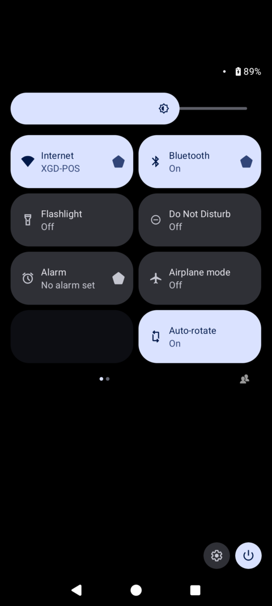

---

## 使用命令编译
### 环境依赖
*  Gradle 8.7
*  JDK version 17

```
# 构建环境
gradle wrapper

# 执行预过滤任务
./gradlew :Filter:run

# 打包编译
./gradlew assemble
```

## 在Android Studio上编译
### 推荐使用
*  Android Studio Koala & JDK version 17

#### 第一步：运行在Filter上的主函数，会执行两个过滤任务


*  移除一些AS不支持的属性和字段，以及减少国际化语言，加快编译速度


*  执行暴力过滤任务，替代一些无法被引用的资源等。


### 第二步：执行Android Studio上Build APK的操作, 然后将apk推送到设备上SystemUI所在的目录

```
adb push SystemUI.apk /system/system_ext/priv-app/SystemUI/

adb shell killall com.android.systemui
```
#####  首次推送会起不来，需要重启一下设备
```
adb reboot
```


## 构建步骤

### Step1：引入静态依赖
##### @framework.jar:
```
// android-14/out/target/common/obj/JAVA_LIBRARIES/framework_intermediates/classes-header.jar
compileOnly files('libs/framework.jar')
```


##### @core-all.jar:
```
// android-14/out/soong/.intermediates/libcore/core-all/android_common/javac/core-all.jar
compileOnly files('libs/core-all.jar')
```


##### @libprotobuf-java-nano.jar:
```
// android-14/out/soong/.intermediates/external/protobuf/libprotobuf-java-nano/android_common/javac/libprotobuf-java-nano.jar
implementation files('libs/libprotobuf-java-nano.jar')
```


##### @libmonet.jar:
```
// android-14/out/soong/.intermediates/external/libmonet/libmonet/android_common/e18b8e8d84cb9f664aa09a397b08c165/javac/libmonet.jar
implementation files('libs/libmonet.jar')
```
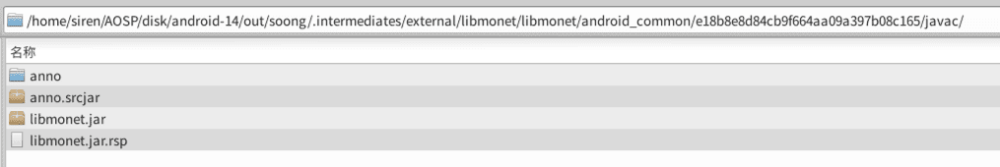

##### @core-icu4j.jar:
```
// android-14/out/soong/.intermediates/external/icu/android_icu4j/core-icu4j/android_common/javac/core-icu4j.jar
implementation files('libs/core-icu4j.jar')
```


##### @com.android.window.flags.window-aconfig-java.jar:
```
// android-14/out/soong/.intermediates/frameworks/base/com.android.window.flags.window-aconfig-java/android_common/javac/com.android.window.flags.window-aconfig-java.jar
implementation files('com.android.window.flags.window-aconfig-java.jar')
```


##### @com_android_systemui_flags_lib.jar:
```
// android-14/out/soong/.intermediates/frameworks/base/packages/SystemUI/aconfig/com_android_systemui_flags_lib/android_common/e18b8e8d84cb9f664aa09a397b08c165/javac/com_android_systemui_flags_lib.jar
implementation files('com_android_systemui_flags_lib.jar')
```


##### @com_android_systemui_shared_flags_lib.jar:
```
// android-14/out/soong/.intermediates/frameworks/libs/systemui/aconfig/com_android_systemui_shared_flags_lib/android_common/e18b8e8d84cb9f664aa09a397b08c165/javac/com_android_systemui_shared_flags_lib.jar
implementation files('com_android_systemui_shared_flags_lib.jar')
```
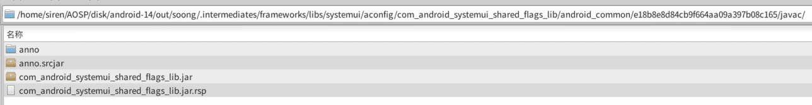

##### @com_android_wm_shell_flags_lib.jar:
```
// android-14/out/soong/.intermediates/frameworks/base/libs/WindowManager/Shell/aconfig/com_android_wm_shell_flags_lib/android_common/e18b8e8d84cb9f664aa09a397b08c165/javac/com_android_wm_shell_flags_lib.jar
implementation files('com_android_wm_shell_flags_lib.jar')
```
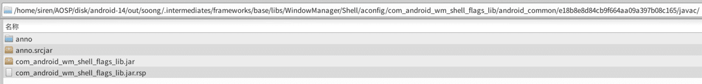

##### @motion_tool_lib.jar:
```
// android-14/out/soong/.intermediates/frameworks/libs/systemui/motiontoollib/motion_tool_lib/android_common/e18b8e8d84cb9f664aa09a397b08c165/kotlin/motion_tool_lib.jar
implementation files('libs/motion_tool_lib.jar')
kapt files('libs/motion_tool_lib.jar')
```
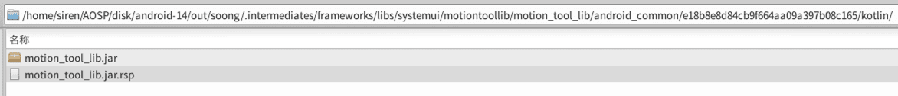

##### @motion_tool_proto.jar:
```
// android-14/out/soong/.intermediates/frameworks/libs/systemui/motiontoollib/motion_tool_proto/android_common/e18b8e8d84cb9f664aa09a397b08c165/javac/motion_tool_proto.jar
implementation files('motion_tool_proto.jar')
```
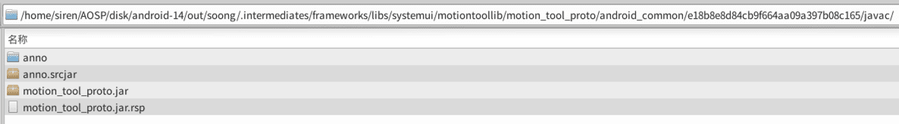


##### @notification_flags_lib.jar:
```
// android-14/out/soong/.intermediates/packages/modules/Connectivity/staticlibs/net-utils-framework-common/android_common/javac/notification_flags_lib.jar
implementation files('libs/notification_flags_lib.jar')
```
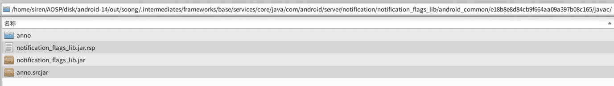


##### @perfetto_trace_java_protos.jar:
```
// android-14/out/soong/.intermediates/external/perfetto/perfetto_trace_java_protos/android_common/e18b8e8d84cb9f664aa09a397b08c165/javac/perfetto_trace_java_protos.jar
implementation files('libs/perfetto_trace_java_protos.jar')
```


##### @settingslib_flags_lib.jar:
```
// android-14/out/soong/.intermediates/frameworks/base/packages/SettingsLib/settingslib_flags_lib/android_common/e18b8e8d84cb9f664aa09a397b08c165/javac/settingslib_flags_lib.jar
implementation files('libs/settingslib_flags_lib.jar')
```
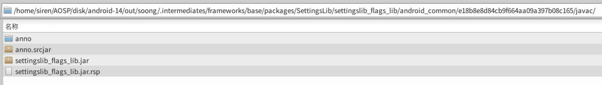

##### @tracinglib-platform.jar:
```
// android-14/out/soong/.intermediates/frameworks/libs/systemui/tracinglib/tracinglib-platform/android_common/e18b8e8d84cb9f664aa09a397b08c165/kotlin/tracinglib-platform.jar
implementation files('libs/tracinglib-platform.jar')
```
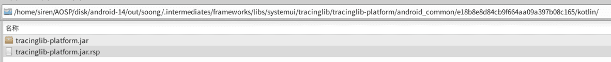

##### @device_state_flags_lib.jar:
```
// android-14/out/soong/.intermediates/frameworks/base/services/foldables/devicestateprovider/src/com/android/server/policy/feature/device_state_flags_lib/android_common/e18b8e8d84cb9f664aa09a397b08c165/javac/device_state_flags_lib.jar
implementation files('device_state_flags_lib.jar')
```
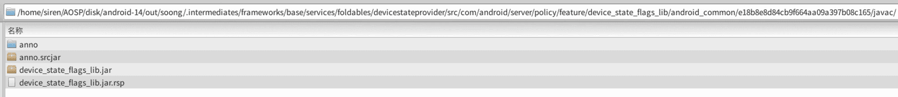

##### @WindowManager-Shell-proto.jar:
```
// android-14/out/soong/.intermediates/frameworks/base/libs/WindowManager/Shell/WindowManager-Shell-proto/android_common/e18b8e8d84cb9f664aa09a397b08c165/javac/WindowManager-Shell-proto.jar
implementation files('libs/WindowManager-Shell-proto.jar')
```


##### @WindowManager-Shell-shared.jar:
```
// android-14/out/soong/.intermediates/frameworks/base/libs/WindowManager/Shell/WindowManager-Shell-shared/android_common/e18b8e8d84cb9f664aa09a397b08c165/javac/WindowManager-Shell-shared.jar
implementation files('libs/WindowManager-Shell-shared.jar')
```
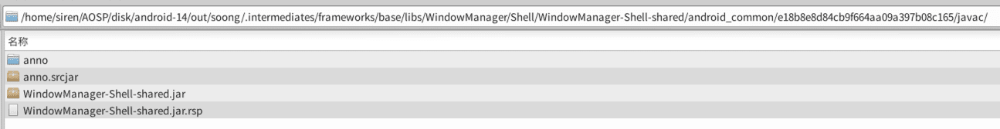

##### @zxing-core.jar:
```
// android-14/out/soong/.intermediates/external/zxing/zxing-core/android_common/e18b8e8d84cb9f664aa09a397b08c165/javac/zxing-core.jar
implementation files('libs/zxing-core.jar')
```
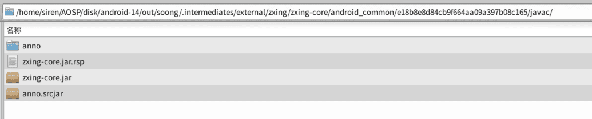


##### @SystemUI-proto.jar:
```
// android-14/out/soong/.intermediates/frameworks/base/packages/SystemUI/SystemUI-proto/android_common/e18b8e8d84cb9f664aa09a397b08c165/javac/SystemUI-proto.jar
implementation files('libs/SystemUI-proto.jar')
```


##### @SystemUI-statsd.jar:
```
// android-14/out/soong/.intermediates/frameworks/base/packages/SystemUI/shared/SystemUI-statsd/android_common/e18b8e8d84cb9f664aa09a397b08c165/javac/SystemUI-statsd.jar
implementation files('libs/SystemUI-statsd.jar')
```


##### @SystemUI-tags.jar:
```
// android-14/out/soong/.intermediates/frameworks/base/packages/SystemUI/SystemUI-tags/android_common/e18b8e8d84cb9f664aa09a397b08c165/javac/SystemUI-tags.jar
implementation files('libs/SystemUI-tags.jar')
```


##### @wifi_aconfig_flags_lib.jar:
```
// android-14/out/soong/.intermediates/packages/modules/Wifi/flags/wifi_aconfig_flags_lib/android_common/e18b8e8d84cb9f664aa09a397b08c165/javac/wifi_aconfig_flags_lib.jar
implementation files('libs/wifi_aconfig_flags_lib.jar')
```


##### @keepanno-annotations.jar:
```
// android-14/prebuilts/r8/keepanno-annotations.jar
implementation files('libs/keepanno-annotations.jar')
```
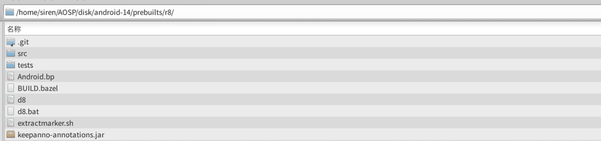


##### @preference-1.3.0-alpha01.aar:
```
// android-14/prebuilts/sdk/current/androidx/m2repository/androidx/preference/preference/1.3.0-alpha01/preference-1.3.0-alpha01.aar
implementation(':preference-1.3.0-alpha01@aar')
```


###### ps: androidx.preference 不容易通过以下方式去引用，故换成静态
```
## implementation 'androidx.preference:preference:1.3.0-alpha01'
```


### Step2：引入Module
###### 将具体路径下的代码直接导入到项目中作为Module依赖, 构建的时候可以直接通过implementation project引用，或者也可以gradle build生成aar,再放置到libs文件夹中，作为静态包使用。

##### @iconloaderlib: 
```
// android-14/frameworks/libs/systemui/iconloaderlib
implementation project(':iconloaderlib')
```


##### @animationlib: 
```
// android-14/frameworks/libs/systemui/animationlib  
implementation project(':animationlib')
```


##### @viewcapturelib: 
```
// android-14/frameworks/libs/systemui/viewcapturelib  
implementation project(':viewcapturelib')
```
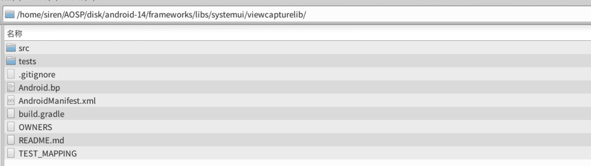

##### @WifiTrackerLib: 
```
// android-14/frameworks/opt/net/wifi/libs/WifiTrackerLib
implementation project(':WifiTrackerLib')
```


##### @Shell: 
```
// android-14/frameworks/base/libs/WindowManager/Shell
implementation project(':Shell')
```


##### @lowlight: 
```
// android-14/frameworks/base/libs/dream/lowlight
implementation project(':lowlight')
```
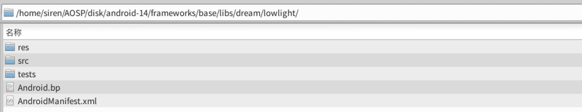


##### @setupcompat: 
```
// android-14/external/setupcompat
implementation project(':setupcompat')
```
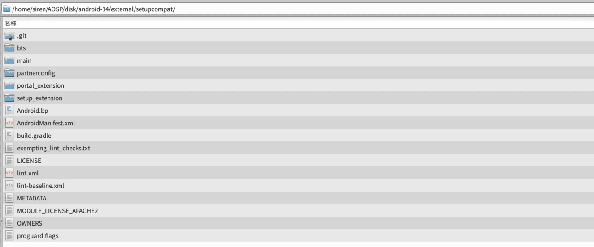


##### @setupdesign: 
```
// android-14/external/setupdesign
implementation project(':setupdesign')
```


##### @SettingsLib: 
```
// android-14/frameworks/base/packages/SettingsLib
include ':SettingsLib'
include 'SettingsLib:Tile'
include 'SettingsLib:AdaptiveIcon'
include 'SettingsLib:RestrictedLockUtils'
include 'SettingsLib:HelpUtils'
include 'SettingsLib:SettingsTheme'
include 'SettingsLib:AppPreference'
include 'SettingsLib:SearchWidget'
include 'SettingsLib:SettingsSpinner'
include 'SettingsLib:LayoutPreference'
include 'SettingsLib:ActionButtonsPreference'
include 'SettingsLib:EntityHeaderWidgets'
include 'SettingsLib:BarChartPreference'
include 'SettingsLib:ProgressBar'
include 'SettingsLib:Utils'
include 'SettingsLib:ActionBarShadow'
include 'SettingsLib:search'
include 'SettingsLib:ActivityEmbedding'
include 'SettingsLib:BannerMessagePreference'
include 'SettingsLib:SettingsTransition'
include 'SettingsLib:CollapsingToolbarBaseActivity'
include 'SettingsLib:EmergencyNumber'
include 'SettingsLib:FooterPreference'
include 'SettingsLib:IllustrationPreference'
include 'SettingsLib:UsageProgressBarPreference'
include 'SettingsLib:TwoTargetPreference'
include 'SettingsLib:TopIntroPreference'
include 'SettingsLib:MainSwitchPreference'
include 'SettingsLib:ButtonPreference'
include 'SettingsLib:SelectorWithWidgetPreference'
include 'SettingsLib:Color'
include 'SettingsLib:DataStore'
include 'SettingsLib:DeviceStateRotationLock'
include 'SettingsLib:DisplayUtils'
include 'SettingsLib:ProfileSelector'
```


## 生成platform.keystore默认签名

在AOSP/android-14/build/target/product/security路径下找到签名证书，并使用 [keytool-importkeypair](https://github.com/getfatday/keytool-importkeypair) 生成keystore,
执行如下命令：

```
./keytool-importkeypair -k platform.keystore -p 123456 -pk8 platform.pk8 -cert platform.x509.pem -alias platform
```

并将以下代码添加到gradle配置中：

```
    signingConfigs {
        platform {
            storeFile file("platform.keystore")
            storePassword '123456'
            keyAlias 'platform'
            keyPassword '123456'
        }
    }

    buildTypes {
        release {
            debuggable false
            minifyEnabled false
            signingConfig signingConfigs.platform
        }

        debug {
            debuggable true
            minifyEnabled false
            signingConfig signingConfigs.platform
        }
    }
```

### PS:
##### 查看被忽略的文件列表
```
git ls-files -v | grep '^h\ '
```  

##### 忽略和还原单个文件
``` 
git update-index --assume-unchanged $path
git update-index --no-assume-unchanged $path
``` 

##### 还原全部被忽略的文件
```
git ls-files -v | grep '^h' | awk '{print $2}' |xargs git update-index --no-assume-unchanged 
```

---

### 关联项目
* [Settings](https://github.com/siren-ocean/Settings)
* [Launcher3](https://github.com/siren-ocean/Launcher3)
* [DocumentsUI](https://github.com/siren-ocean/DocumentsUI)
* [Camera2](https://github.com/siren-ocean/Camera2)
* [PermissionController](https://github.com/siren-ocean/PermissionController)