# [English](README.md) | 中文文档
## SystemUI from android-12.1.0_r11
### SystemUI脱离源码在Android Studio的编译
##### 不同安卓版本的支持请切换到对应的分支
### 支持说明
* 不试图改变项目本身的目录结构
* 通过添加额外的配置和依赖构建Gradle环境支持
* 会使用脚本移除一些AS不支持的属性和字段，然后利用git本地忽略
* 运行的效果会与原生的有些许差异，其中一个原因是脱离源码之后，引用private属性失败所导致的样式差异，另一个原因是androidprv的属性无法被AS正常识别，会被我们用脚本进行暂时性的替代。（如下图）


###  pixel4运行效果：Gradle编译 VS Android.bp编译
---
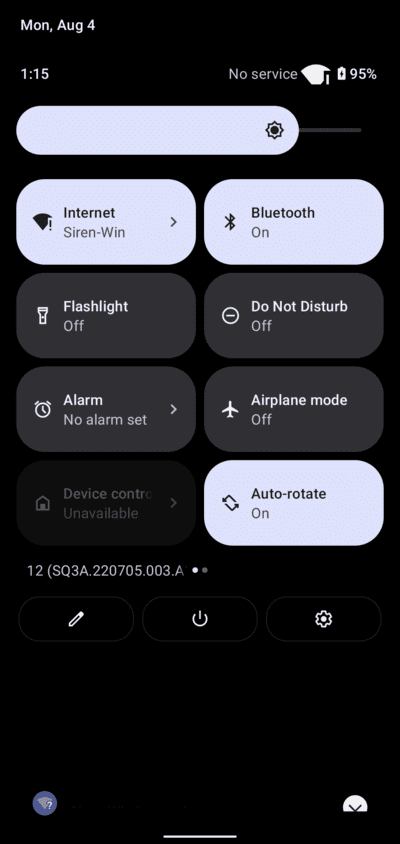 

---

## 使用命令编译
### 环境依赖
*  Gradle 7.3.3
*  JDK version 11

```
# 构建环境
gradle wrapper

# 执行预过滤任务
./gradlew :Filter:run

# 打包编译
 ./gradlew assemble
```

## 在Android Studio上编译
### 推荐使用
*  Android Studio Koala & JDK version 11

#### 第一步：运行在Filter上的主函数，会执行两个过滤任务
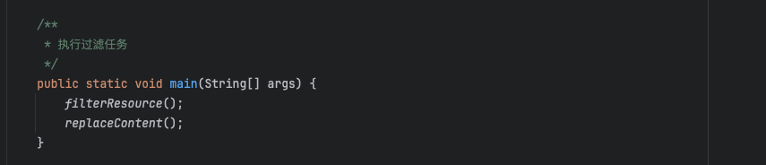

*  移除一些AS不支持的属性和字段，以及减少国际化语言，加快编译速度

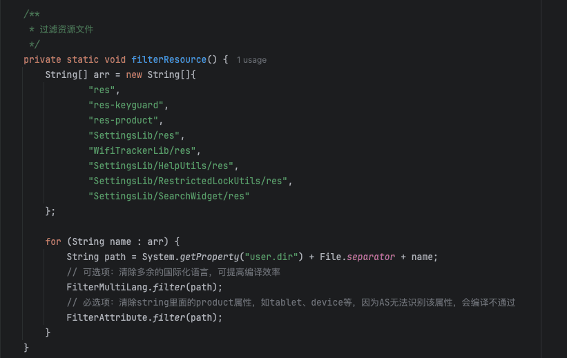

*  替代AS中不支持的androidprv:attr属性

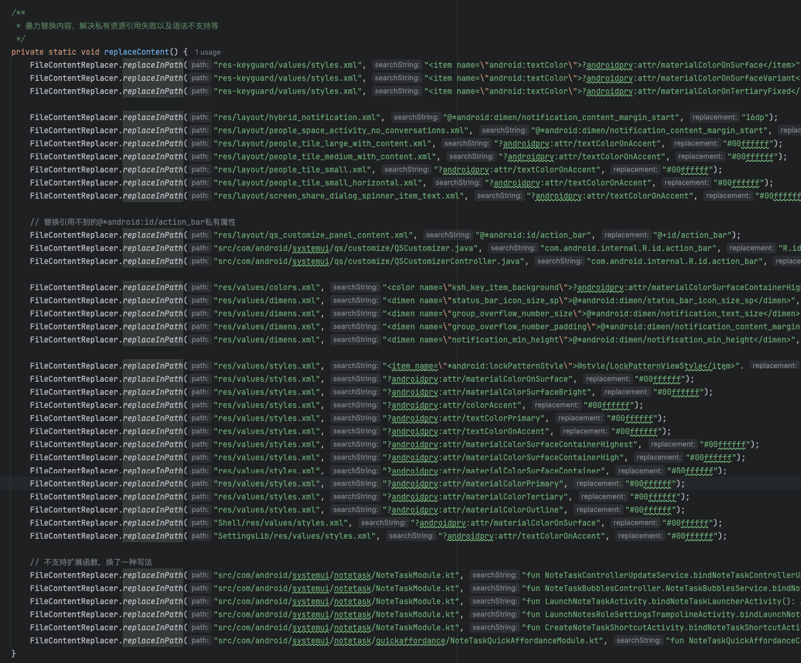

### 第二步：执行Android Studio上Build APK的操作, 然后将apk推送到设备上SystemUI所在的目录

```
adb push SystemUI.apk /system/system_ext/priv-app/SystemUI/

adb shell killall com.android.systemui
```
#####  首次推送会起不来，需要重启一下设备
```
adb reboot
```


## 构建步骤

### Step1：引入静态依赖
##### @framework.jar:
```
// android-12/out/target/common/obj/JAVA_LIBRARIES/framework_intermediates/classes-header.jar
compileOnly files('libs/framework.jar')
```


##### @core-all.jar:
```
// android-12/out/soong/.intermediates/libcore/core-all/android_common/javac/core-all.jar
compileOnly files('libs/core-all.jar')
```


##### @libprotobuf-java-nano.jar:
```
// android-12/out/soong/.intermediates/external/protobuf/libprotobuf-java-nano/android_common/javac/libprotobuf-java-nano.jar
implementation files('libs/libprotobuf-java-nano.jar')
```
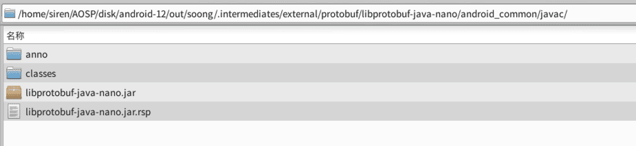

##### @core-icu4j.jar:
```
// android-12/out/soong/.intermediates/external/icu/android_icu4j/core-icu4j/android_common/javac/core-icu4j.jar
implementation files('libs/core-icu4j.jar')
```
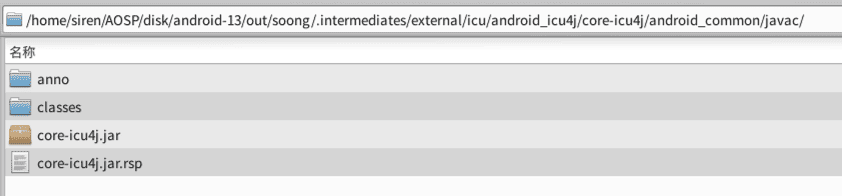

##### @protolog-lib.jar:
```
// android-12/out/soong/.intermediates/frameworks/base/core/java/protolog-lib/android_common/javac/protolog-lib.jar
implementation files('libs/protolog-lib.jar')
```


##### @WindowManager-Shell-proto.jar:
```
// android-12/out/soong/.intermediates/frameworks/base/libs/WindowManager/Shell/WindowManager-Shell-proto/android_common/javac/WindowManager-Shell-proto.jar
implementation files('libs/WindowManager-Shell-proto.jar')
```


##### @SystemUI-proto.jar:
```
// android-12/out/soong/.intermediates/frameworks/base/packages/SystemUI/SystemUI-proto/android_common/javac/SystemUI-proto.jar
implementation files('libs/SystemUI-proto.jar')
```
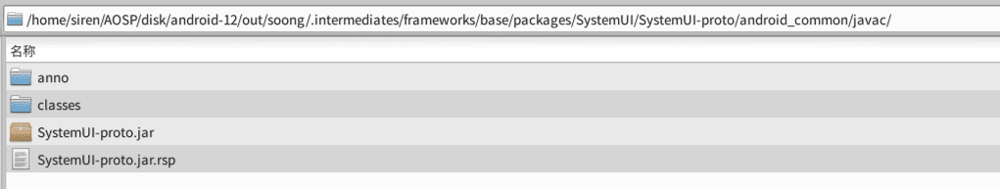


##### @SystemUI-statsd.jar:
```
// android-12/out/soong/.intermediates/frameworks/base/packages/SystemUI/shared/SystemUI-statsd/android_common/javac/SystemUI-statsd.jar
implementation files('libs/SystemUI-statsd.jar')
```
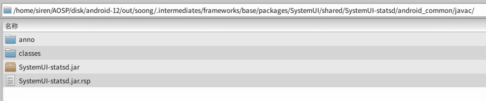

##### @SystemUI-tags.jar:
```
// android-12/out/soong/.intermediates/frameworks/base/packages/SystemUI/SystemUI-tags/android_common/javac/SystemUI-tags.jar
implementation files('libs/SystemUI-tags.jar')
```
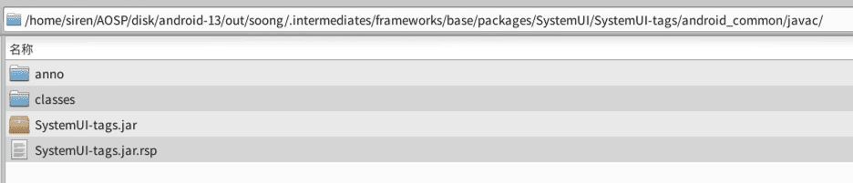

##### @preference-1.2.0-alpha01.aar:
```
// android-12/prebuilts/sdk/current/androidx/m2repository/androidx/preference/preference/1.2.0-alpha01/preference-1.2.0-alpha01.aar
implementation(name: 'preference-1.2.0-alpha01', ext: 'aar')
```


##### @dynamicanimation-1.1.0-alpha04.aar:
```
// android-12/prebuilts/sdk/current/androidx/m2repository/androidx/dynamicanimation/dynamicanimation/1.1.0-alpha04/dynamicanimation-1.1.0-alpha04.aar
implementation(name: 'dynamicanimation-1.1.0-alpha04', ext: 'aar')
```

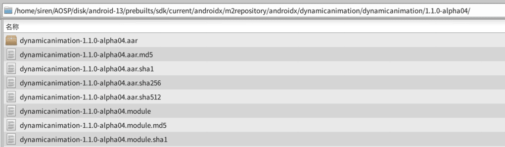


###### ps: androidx.preference 和 androidx.dynamicanimation 不容易通过以下方式去引用，故换成静态
```
## implementation 'androidx.preference:preference:1.2.0-alpha01'
## implementation 'androidx.dynamicanimation:dynamicanimation:1.1.0-alpha04'
```


### Step2：引入Module
###### 将具体路径下的代码直接导入到项目中作为Module依赖, 构建的时候可以直接通过implementation project引用，或者也可以gradle build生成aar,再放置到libs文件夹中，作为静态包使用。

##### @iconloaderlib: 
```
// android-12/frameworks/libs/systemui/iconloaderlib
implementation project(':iconloaderlib')
```
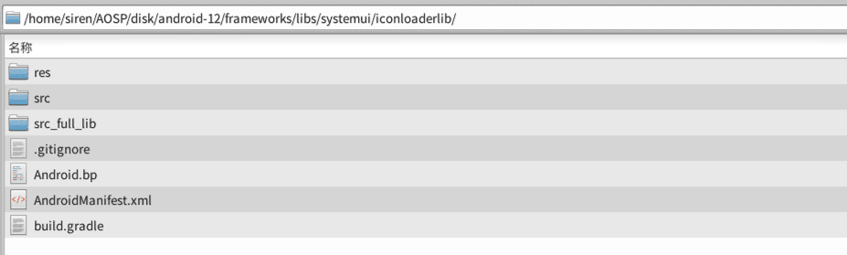


##### @WifiTrackerLib: 
```
// android-12/frameworks/opt/net/wifi/libs/WifiTrackerLib
implementation project(':WifiTrackerLib')
```
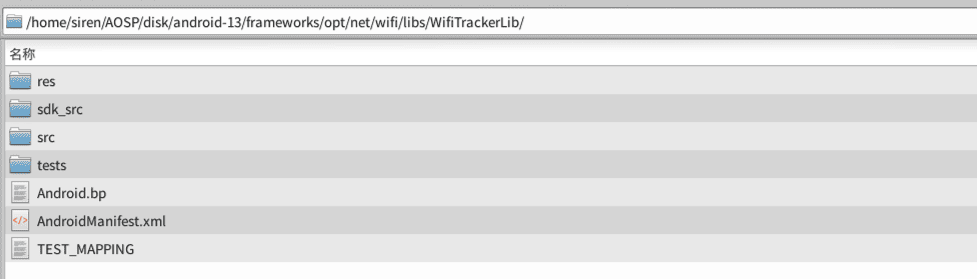


##### @Shell: 
```
// android-12/frameworks/base/libs/WindowManager/Shell
implementation project(':Shell')
```


##### @SettingsLib: 
```
// android-12/frameworks/base/packages/SettingsLib
implementation project(':SettingsLib')
implementation project(':SettingsLib:ActionBarShadow')
implementation project(':SettingsLib:RestrictedLockUtils')
implementation project(':SettingsLib:ActionButtonsPreference')
implementation project(':SettingsLib:HelpUtils')
implementation project(':SettingsLib:SettingsSpinner')
implementation project(':SettingsLib:Tile')
implementation project(':SettingsLib:LayoutPreference')
implementation project(':SettingsLib:AppPreference')
implementation project(':SettingsLib:RadioButtonPreference')
implementation project(':SettingsLib:search')
implementation project(':SettingsLib:SearchWidget')
implementation project(':SettingsLib:EntityHeaderWidgets')
implementation project(':SettingsLib:AdaptiveIcon')
implementation project(':SettingsLib:DisplayDensityUtils')
implementation project(':SettingsLib:IllustrationPreference')
implementation project(':SettingsLib:SettingsTransition')
implementation project(':SettingsLib:MainSwitchPreference')
implementation project(':SettingsLib:TwoTargetPreference')
implementation project(':SettingsLib:FooterPreference')
implementation project(':SettingsLib:BannerMessagePreference')
implementation project(':SettingsLib:TopIntroPreference')
implementation project(':SettingsLib:UsageProgressBarPreference')
implementation project(':SettingsLib:CollapsingToolbarBaseActivity')
implementation project(':SettingsLib:EmergencyNumber')
```


## 生成platform.keystore默认签名

在AOSP/android-12/build/target/product/security路径下找到签名证书，并使用 [keytool-importkeypair](https://github.com/getfatday/keytool-importkeypair) 生成keystore,
执行如下命令：

```
./keytool-importkeypair -k platform.keystore -p 123456 -pk8 platform.pk8 -cert platform.x509.pem -alias platform
```

并将以下代码添加到gradle配置中：

```
    signingConfigs {
        platform {
            storeFile file("platform.keystore")
            storePassword '123456'
            keyAlias 'platform'
            keyPassword '123456'
        }
    }

    buildTypes {
        release {
            debuggable false
            minifyEnabled false
            signingConfig signingConfigs.platform
        }

        debug {
            debuggable true
            minifyEnabled false
            signingConfig signingConfigs.platform
        }
    }
```

### PS:
##### 查看被忽略的文件列表
```
git ls-files -v | grep '^h\ '
```  

##### 忽略和还原单个文件
``` 
git update-index --assume-unchanged $path
git update-index --no-assume-unchanged $path
``` 

##### 还原全部被忽略的文件
```
git ls-files -v | grep '^h' | awk '{print $2}' |xargs git update-index --no-assume-unchanged 
```

---

### 关联项目
* [Settings](https://github.com/siren-ocean/Settings)
* [Launcher3](https://github.com/siren-ocean/Launcher3)
* [DocumentsUI](https://github.com/siren-ocean/DocumentsUI)
* [Camera2](https://github.com/siren-ocean/Camera2)
* [PermissionController](https://github.com/siren-ocean/PermissionController)