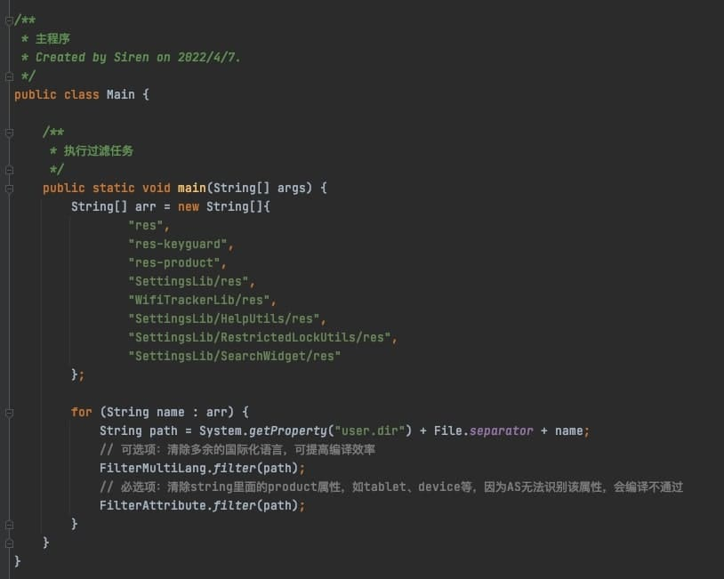

## SystemUI from android-11.0.0_r10
### SystemUI脱离源码，并在Android Studio进行编译，最重要的一点是不试图改变它本身的目录结构，而是通过添加额外的配置和依赖，既能支持本地运行，又不影响其在AOSP上使用Android.bp进行系统编译。
### 本项目会在关键的地方，利用脚本移除相关的在AndroidStudio上所不支持的属性和字段，并通过git命令将其忽略(不往仓库上提交)，使其在本地能正常运行的同时，也不影响它在AOSP总体仓库的份量。


## 执行步骤如下
#### 第一步：运行在Filter上的主函数，执行过滤任务


### 第二步：执行Android Studio上Build APK的操作, 然后将apk推送到设备上SystemUI所在的目录

```
adb push SystemUI.apk /system/system_ext/priv-app/SystemUI/
adb shell killall com.android.systemui

```
######  如果SystemUI不能正常起来，则需要重启一下设备
```
adb reboot
```

###  测试在pixel2上运行结果：Gradle编译 VS Android.bp编译
 

---
######  此时我们发现运行的效果会与原生的还是有些许之间的差异，这是由于脱离源码之后，SystemUI在一些private属性上的引用失败所导致的样式差异，目前看来并没有什么特别的办法。


